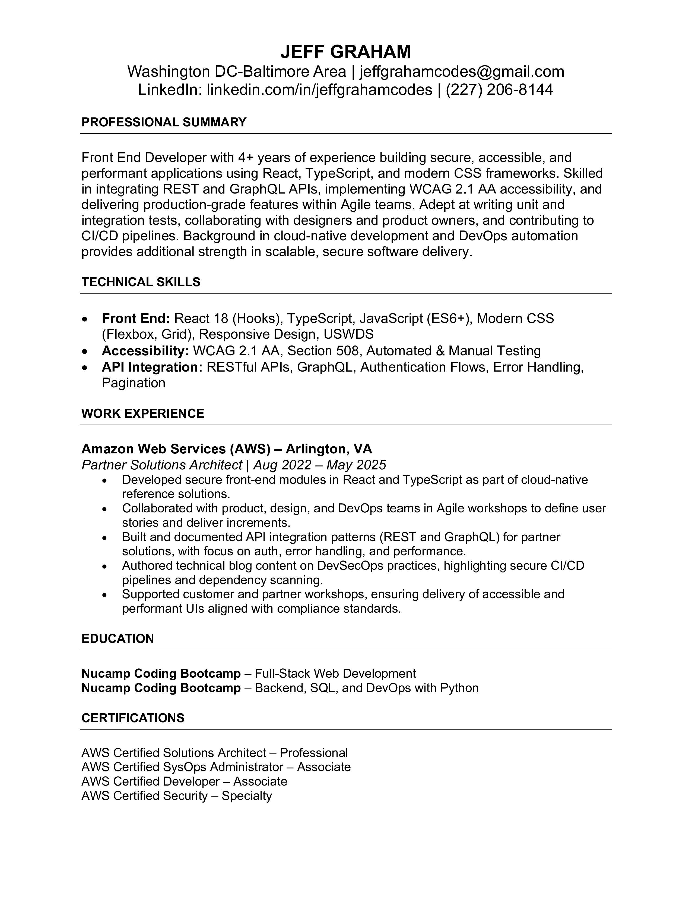
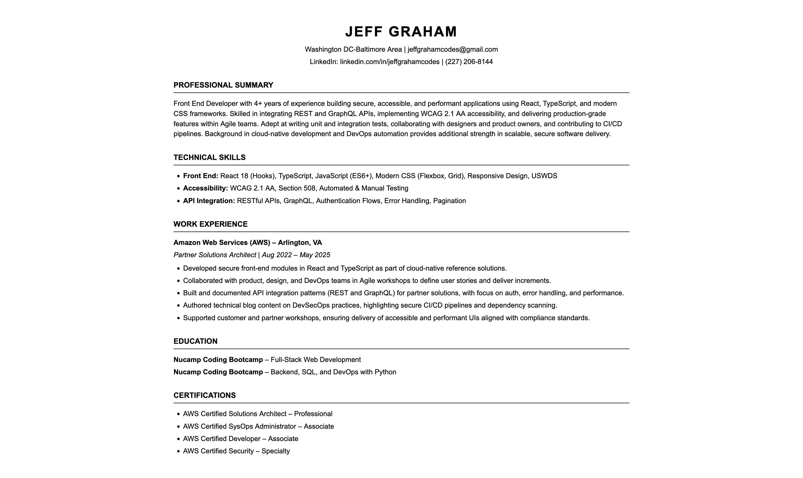

# Frontend Technical Specification

Create a static website that serves an HTML resume.

### Resume Format Generation

GenAI was used to generate the initial HTML/CSS.

Prompt (ChatGPT 5):

```text
Convert this resume format into HTML.
Please don't use a CSS framework and use the least amount of tags.
```

Image provided to the LLM:


Initial generated output:
[docs/resume-11-26-25.html](./docs/resume-11-26-25.html)

Rendered preview of the initial HTML:

